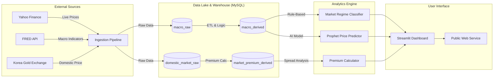

# 💰 Enterprise Macro Analysis System (AI & Big Data)
> **"Real-World Decision Support System for Gold & Macro Economics"**


## 🌐 Live Service
*   **Landing Page (Public)**: [https://srunaic.github.io/my_DashBoard_AI_BigData/](https://srunaic.github.io/my_DashBoard_AI_BigData/)
*   **Dashboard App**: *(Connect your Streamlit Cloud URL here)*

---

## 📖 Project Overview
This project is an **Enterprise-grade AI & Big Data Platform** designed to analyze macro-economic indicators (Gold, USD, Rates) and detect market crises.
Unlike simple dashboards, this system features a **Dual-Layer Data Architecture (Raw/Derived)**, **AI-based Price Forecasting**, and **Real-World Market Distortion Analysis (Kimchi Premium)**.

It is fully automated via **GitHub Actions** and deployed as a publicly searchable web service verified by **Google Search Console**.

### 🏗️ System Architecture


---

## 🚀 Key Features

### 1. 🤖 AI Price Prediction (Prophet)
- Utilizes Facebook's **Prophet** time-series model.
- Learns from 3+ years of historical Gold/USD data.
- Generates a **30-day future price scenario** with 95% confidence intervals.

### 2. 🌶️ Market Distortion Analysis (Kimchi Premium)
- **Problem**: Domestic gold prices often deviate from international spot prices due to currency & demand shocks.
- **Solution**: Real-time calculation of the "Premium Rate" (Domestic Retail vs. Theoretical Intl Price).
- **Alerts**: Automatically flags "Overheating" (>5%) or "Discount" (<0%) market states.

### 3. 🛡️ Market Regime Classification
- A rule-based engine that determines the current market state:
    - 🟢 **Risk-On**: Safe to invest in equities.
    - 🔴 **Risk-Off**: Warning signal (Strong Dollar/Gold).
    - 📉 **Deflation**: Cash is king.

### 4. ⚙️ Automated Data Pipeline (ETL)
- **Ingestion**: `ingest.py` runs daily via **GitHub Actions** (09:00 KST).
- **Derivation**: `derive.py` standardizes units (oz -> 3.75g/Don) and calculates KPIs.
- **Storage**: Cloud MySQL (Aiven/TiDB) ensures 24/7 availability.

---

## 🔒 Security & Compliance
- **Credentials Management**: All API Keys (FRED, Database) are stored in **GitHub Secrets** and **Streamlit Secrets**. No sensitive keys are exposed in the code.
- **SEO & Searchability**: 
    - Verified domain ownership via **Google Search Console**.
    - SEO-optimized Landing Page (`public/index.html`) for organic search traffic.
- **Legal**: Mandatory financial disclaimers implemented in the dashboard.

---

## 📂 Repository Structure
```bash
├── .github/workflows/   # CI/CD Automation (Daily Ingest, Deploy Pages)
├── public/              # Static Landing Page & SEO Verification
├── src/
│   ├── analysis/        # AI Models, Calculators, Alerts
│   ├── modules/         # DB Connectors, Data Loaders
│   ├── pipeline/        # Ingest, Derive, ETL Scripts
│   └── ui/              # Dashboard Components
├── app.py               # Main Application Entry
├── schema.sql           # Database Schema (DDL)
└── requirements.txt     # Python Dependencies
```

---

## 💻 How to Run
This system is cloud-native, but you can run it locally:

1.  **Clone & Install**:
    ```bash
    git clone https://github.com/srunaic/my_DashBoard_AI_BigData.git
    pip install -r requirements.txt
    ```
2.  **Configure Env**:
    Create `.env` file with your keys (DB, FRED_API).
3.  **Run Pipeline**:
    ```bash
    python src/pipeline/ingest.py
    python src/pipeline/derive.py
    ```
4.  **Launch App**:
    ```bash
    streamlit run app.py
    ```
-develop team srunaic-
*Copyright © 2026. All Rights Reserved.*
